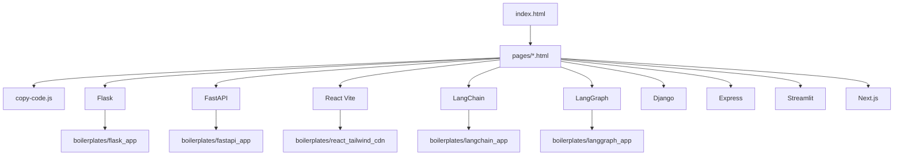

# Commands Boilerplate Hub

Quick-reference developer hub with modular pages, copy-ready code blocks, and multi-stack boilerplates.

Built for fast browsing on GitHub Pages with focused stack pages instead of one long document.

## Live Entry

- Open homepage: [index.html](index.html)
- Stack docs: [pages](pages)
- Demo boilerplates: [boilerplates](boilerplates)

## Why This Repo

- Modular pages for faster load and easier maintenance
- Copy buttons for commands and code snippets
- Ready boilerplate patterns for Python, Node, and frontend stacks
- Environment template patterns for OpenAI, OpenRouter, and Gemini keys

## Stack Pages

| Stack | Docs Page |
|---|---|
| Flask | [pages/flask.html](pages/flask.html) |
| FastAPI | [pages/fastapi.html](pages/fastapi.html) |
| React + Tailwind CDN (Vite) | [pages/react.html](pages/react.html) |
| LangChain | [pages/langchain.html](pages/langchain.html) |
| LangGraph | [pages/langgraph.html](pages/langgraph.html) |
| Django + DRF | [pages/django.html](pages/django.html) |
| Express API | [pages/express.html](pages/express.html) |
| Streamlit | [pages/streamlit.html](pages/streamlit.html) |
| Next.js | [pages/nextjs.html](pages/nextjs.html) |

## Visual Architecture



## Project Layout

```text
BOILERPLATE/
	index.html
	README.md
	pages/
		copy-code.js
		flask.html
		fastapi.html
		react.html
		langchain.html
		langgraph.html
		django.html
		express.html
		streamlit.html
		nextjs.html
	boilerplates/
		flask_app/
		fastapi_app/
		langchain_app/
		langgraph_app/
		react_tailwind_cdn/
```

## Quick Start

1. Clone the repository.
2. Open [index.html](index.html) in a browser.
3. Choose a stack page from [pages](pages).
4. Use copy buttons to copy commands/snippets.
5. Follow the mapped boilerplate folder in [boilerplates](boilerplates).

## GitHub Pages Notes

- Keep [index.html](index.html) at repository root.
- Keep all docs pages under [pages](pages).
- Relative links are already GitHub Pages-friendly.
- After pushing to `main`, enable Pages from repository settings.

## SEO Coverage

- Meta description on homepage and all stack pages
- Open Graph tags for better social previews
- Twitter card tags for shared links
- Robots indexing tags enabled

## Tech Highlights

- Frontend: Tailwind CDN, responsive card-based UI
- Backend: Flask, FastAPI, Django, Express
- AI: LangChain, LangGraph
- App Frameworks: React (Vite), Streamlit, Next.js

